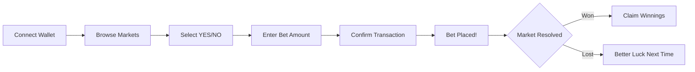

# 🎰 Attention Roulette

> **The World's First Prediction Market for Internet Culture**

Bet on what captures the world's attention. Predict viral moments, tweet battles, and social media drama in real-time on the blockchain.

---

## 🔗 Quick Links

| Resource | Link |
|----------|------|
| **🌐 Live Demo** | [https://lnm-hacks13.onrender.com/](https://lnm-hacks13.onrender.com/) |
| **📜 Smart Contract** | [`0xE5B7B04041A13B2Fe5AAf5dB1784f19EAc2878a0`](https://testnet.monadscan.com/address/0xE5B7B04041A13B2Fe5AAf5dB1784f19EAc2878a0) |
| **⛓️ Network** | Monad Testnet (Chain ID: 10143) |

---

## 🎯 Problem Statement

### The Attention Economy is Broken

In today's digital world, **attention is the most valuable currency**—but there's no way to quantify, trade, or bet on it:

- **Creators** can't monetize their content's viral potential before it happens
- **Users** spend hours consuming content with no way to profit from their predictions
- **Influencers** battle for engagement with no transparent metrics for betting on outcomes
- **The attention economy** remains centralized and controlled by platforms like Twitter/X and Instagram

### The Gap

While prediction markets exist for elections and sports, there's **no decentralized platform** for betting on the internet's most dynamic asset: **viral content**.

---

## 💡 Our Solution

**Attention Roulette** is a Polymarket-style prediction market built specifically for **internet culture and social media virality**.

### How It Works

1. **Browse Markets** - Scroll through active predictions on viral content
2. **Analyze** - Check real-time stats (likes, views, engagement)
3. **Predict** - Bet YES or NO on outcomes with crypto
4. **Win** - If your prediction is correct, claim your winnings from the pool

### Example Markets

- 🐦 _"Will @elonmusk's tweet hit 1M likes before @MrBeast?"_
- 📱 _"Will this Instagram Reel reach 10M views in 24 hours?"_
- 🔥 _"Which viral moment will dominate: Tweet Battle or Reel Wars?"_

---

## ✨ Key Features

| Feature | Description |
|---------|-------------|
| **🎲 Social Prediction Markets** | Bet on viral tweets, reels, and content battles |
| **⛓️ On-Chain Betting** | Fully decentralized betting with smart contracts on Monad |
| **📊 Real-Time Odds** | Dynamic pool percentages update as bets come in |
| **🎯 Auto-Market Creation** | Markets are created on-chain automatically when you bet |
| **💰 Winner-Takes-Pool** | Winners share the losing side's stakes proportionally |
| **🏆 Leaderboard** | Compete with other bettors for top rankings |
| **📱 Social Sharing** | Generate beautiful receipt cards to share on X/Twitter |
| **🔔 Real-Time Notifications** | Toast notifications for all betting activity |
| **🌙 Premium Dark UI** | Glassmorphism design with smooth animations |

---

## 🛠️ Tech Stack

### Frontend
- **Next.js 14** - React framework with App Router
- **React 18** - UI components with hooks
- **TailwindCSS** - Utility-first styling
- **Framer Motion** - Smooth animations
- **Lucide React** - Beautiful icons
- **Zustand** - State management with persistence

### Blockchain
- **Monad Testnet** - High-performance EVM blockchain
- **Solidity** - Smart contract language
- **Ethers.js v6** - Blockchain interactions
- **Wagmi v2** - React hooks for Ethereum
- **Viem** - TypeScript Ethereum library

### Smart Contract
- **OpenZeppelin** - Security standards (ReentrancyGuard, Ownable)
- **Foundry** - Development and testing framework

### Infrastructure
- **Vercel** - Frontend deployment
- **MetaMask** - Wallet connection

---

## 📜 Smart Contract

### Contract Address
```
0xE5B7B04041A13B2Fe5AAf5dB1784f19EAc2878a0
```

### Core Functions

| Function | Description |
|----------|-------------|
| `createMarket(question, duration)` | Create a new prediction market |
| `placeBet(marketId, side)` | Place a bet (YES=true, NO=false) |
| `resolveMarket(marketId, outcome)` | Resolve market (owner only) |
| `claimWinnings(betId)` | Claim winnings from a winning bet |
| `getMarketOdds(marketId)` | Get current YES/NO percentages |

### Fee Structure
- **Platform Fee**: 2% on winnings
- **Winner Payout**: 98% of proportional winnings

---

## 🚀 Getting Started

### Prerequisites
- Node.js 18+ 
- MetaMask wallet
- Monad Testnet tokens (MON)

### Installation

```bash
# Clone the repository
git clone https://github.com/YOUR_USERNAME/attention-roulette.git
cd attention-roulette

# Install dependencies
npm install --legacy-peer-deps

# Run development server
npm run dev
```

### Open the App
Visit [http://localhost:3000](http://localhost:3000)

### Connect Wallet
1. Install MetaMask
2. Add Monad Testnet network
3. Get testnet MON from faucet
4. Connect and start betting!

---

## 🌐 Deployment

### Vercel (Recommended)

1. Push to GitHub
2. Import project on Vercel
3. Deploy (no environment variables needed)

### Build Settings
| Setting | Value |
|---------|-------|
| Framework | Next.js |
| Build Command | `npm run build` |
| Output Directory | `.next` |

---

## 📂 Project Structure

```
attention-roulette/
├── app/                    # Next.js App Router pages
│   ├── page.tsx           # Home (Markets feed)
│   ├── leaderboard/       # Leaderboard page
│   └── profile/           # User dashboard
├── components/            # React components
│   ├── SocialPredictionCard.tsx  # Market cards
│   ├── BetModal.tsx       # Betting interface
│   ├── Header.tsx         # Navigation
│   └── ...
├── contracts/             # Solidity smart contracts
│   └── src/
│       └── PredictionMarket.sol
├── lib/                   # Utilities & stores
│   ├── stores/            # Zustand state
│   ├── web3/              # Blockchain utilities
│   └── data.ts            # Mock market data
└── public/                # Static assets
```

---

## 🎮 User Flow



---

## 🏆 Hackathon

**Built for LNM Hacks × Monad Hackathon**

This project demonstrates:
- ✅ Full-stack Web3 development
- ✅ Smart contract deployment on Monad
- ✅ Real-time blockchain interactions
- ✅ Production-ready UI/UX
- ✅ Social sharing integration

---

## 👥 Team

Built with ❤️ by the Attention Roulette team

---

## 📄 License

MIT License - see [LICENSE](LICENSE) for details

---

<p align="center">
  <b>🎰 Bet on Attention. Win the Internet. 🎰</b>
</p>
